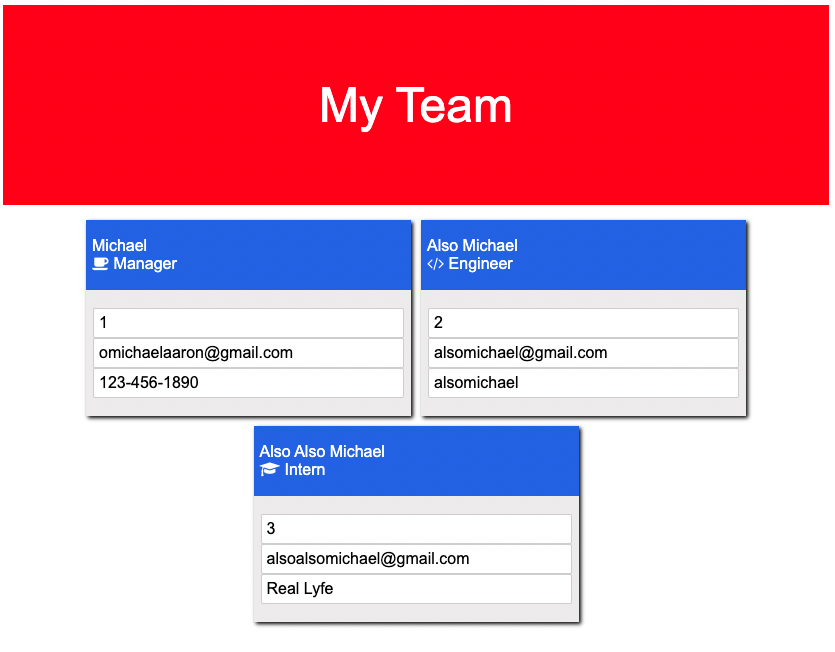

# Team Profile Generator
<p />By Michael Martens

[](https://opensource.org/licenses/MIT)

## Description
Use this tool to create a team profile consisting of Managers, Engineers, and Interns. The site is responsive and the app comes complete with 17 tests (that all pass -- fingers crossed!).

Check out an example video [here](https://drive.google.com/file/d/1ou00znGm5uZNbcBkbCgmlr4WUlIpqEab/view?usp=sharing).


<br>

## Table of Contents
[Installation](#installation)<br />[Usage](#usage)<br />[License](#license)<br />[Contributing](#contributing)<br />[Tests](#tests)<br />[Questions](#questions)

## Installation
Clone the repo > run ```npm install``` to intialize the included dependencies > run ```node index.js``` to begin taking input.

## Usage
Its a great starting point. Run the intial prompts and then take over manually for further editing!

In terms of what you'll be asked.. we ask for the following input:

1. Employee Type
2. Employee Name
3. Employee Id
4. Employee Email
5. Employee Role

Then, depending on who you choose:
6. Office Number (Manager)
7. GitHub (Engineer)
8. School (Intern)

After some formatting to keep things looking pretty, we will return an ``index.html`` file containing all info that was input.

## License
This project is licensed under the MIT license.

A short and simple permissive license with conditions only requiring preservation of copyright and license notices. Licensed works, modifications, and larger works may be distributed under different terms and without source code.<p />For more information visit https://choosealicense.com/licenses/mit/.

## Contributing
Other than what I learned in class, just myself! I grabbed most of my inspiration from the provided resources.

## Tests
There are 4 Test Suites compromising of 17 total tests. You can run these by running ``npm test``.

## Questions
Find me on Github at https://github.com/makeithappenmike<p/>You can reach me at omichaelaaron@gmail.com if you have any questions.